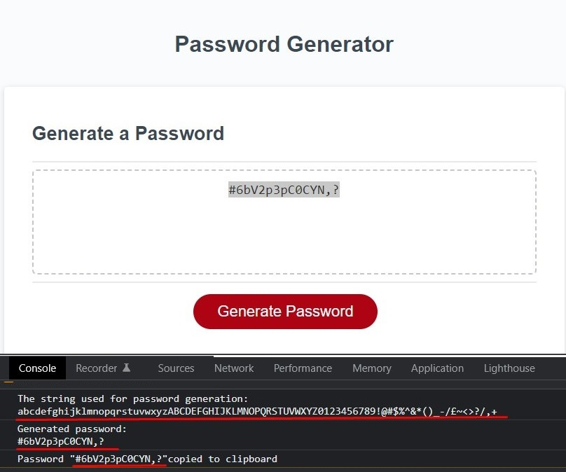
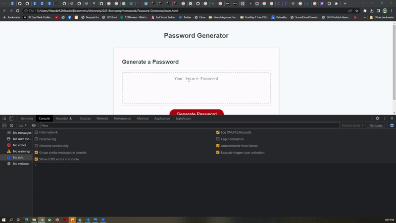

# Password-Generator
Module 3 Assignment for Birmingham University Code Bootcamp
### This password generator includes the following
* Asks for password length
* Asks complexity questions
* Based on the answer creates the character array for password generation.
* Uses the array to generate the needed complexity and lengths password.
* Looks out for the user providing less 8 than or over 128 character lengths
* Gives the user another chance to restart
* Else just shows a message.

!! Just extra !!
Also adds the output in console.log, so it is easier to follow.
Also copies the password to the clipboard.

## Preview and usage example gif

As required we need to show how the solution looks/is used.

### Screenshot 

###  Usage example 

### This Password generator follows the outlined use case
GIVEN I need a new, secure password
* WHEN I click the button to generate a password
  * THEN I am presented with a series of prompts for password criteria
* WHEN prompted for password criteria
  * THEN I select which criteria to include in the password
* WHEN prompted for the length of the password
  * THEN I choose a length of at least 8 characters and no more than 128 characters
* WHEN asked for character types to include in the password
  * THEN I confirm whether or not to include lowercase, uppercase, numeric, and/or special characters
* WHEN I answer each prompt
  * THEN my input should be validated and at least one character type should be selected
* WHEN all prompts are answered
  * THEN a password is generated that matches the selected criteria
* WHEN the password is generated
  * THEN the password is either displayed in an alert or written to the page
